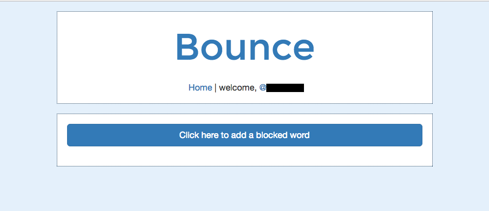

# B0UNC3
Sinatra and Ruby simulation app that monitors users' mentions and automatically mutes accounts based on words or phrases listed by user.

## Problem
A user can input words and phrases that act as PTSD triggers. The app monitors the user's mentions and automatically mutes accounts that use those triggers. If the app accidentally mutes the user's friends, the user can check their profile for a list of muted tweets and accounts and choose to unmute.

## Conclusion
Two days after starting this project, [Twitter released their own monitoring capabilities](http://www.socialmediatoday.com/social-networks/twitter-adds-new-mute-words-tool-new-processes-combat-platform-abuse) and added the ability to mute single tweets to their API (versus muting an entire account).

## Instructions
The app automatically signs you into your Twitter account when you visit the home page.

* Pull down the code and input your Twitter access tokens and consumer keys.
* Run the code locally and input blocked phrases or words, separated by commas.

* Scan your mentions for those words, and blocked tweets and accounts section of your profile will auto-populate.

* Code that will actually mute users is commented out.
